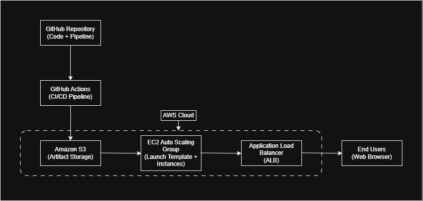

# AWS CI/CD Production Web Platform

This project demonstrates how to design, build, and operate a production-style web platform on AWS using real-world cloud and DevOps practices such as load balancing, auto scaling, CI/CD automation, secure IAM integration, and deployment debugging.

## Project Overview

This project is a hands-on implementation of a real-world cloud deployment architecture.

It simulates how modern engineering teams deploy applications using:

- Automated CI/CD pipelines  
- Scalable cloud infrastructure  
- Secure access between systems  
- Zero manual deployment on servers  
- Real debugging of production-like issues  

The focus of this project is not just to "make it work", but to understand:
- Why each component is used  
- How components interact  
- What breaks in real systems  
- How engineers debug and fix those issues  

## Architecture

This project follows a production-style architecture commonly used in real systems.

Core components:

- **GitHub Repository**  
  Stores application code and triggers the pipeline on every change.

- **GitHub Actions (CI/CD Pipeline)**  
  Automatically validates and deploys the application when code is pushed.

- **Amazon S3 (Artifact Storage)**  
  Stores the application file that EC2 instances pull from.

- **EC2 Auto Scaling Group (ASG)**  
  Runs multiple EC2 instances and replaces unhealthy ones automatically.

- **Launch Template**  
  Ensures every EC2 instance is configured identically at launch.

- **Application Load Balancer (ALB)**  
  Distributes traffic across multiple EC2 instances for high availability.

High-level flow:

Developer → GitHub → GitHub Actions → S3 → EC2 (ASG) → ALB → Users

## What I Built

This is not a theoretical project. I actually built and validated the following:

- Created EC2 instances behind an Application Load Balancer  
- Configured an Auto Scaling Group to maintain multiple healthy instances  
- Used Launch Templates to ensure all instances are configured the same way  
- Built a CI/CD pipeline using GitHub Actions  
- Configured GitHub Actions to securely connect to AWS using IAM and secrets  
- Deployed application artifacts to Amazon S3 automatically  
- Configured EC2 instances to continuously sync the application from S3  
- Verified that new instances launched by Auto Scaling behave correctly  
- Tested deployment by updating code and observing live changes

## Challenges and What I Learned

During this project, I intentionally worked through real-world issues instead of avoiding them.

Some key challenges I faced and solved:

- **Inconsistent behavior across instances behind a load balancer**  
  Sometimes the application appeared correct, sometimes it did not.  
  I learned this was because only one instance was configured correctly while others were not.

- **Cron jobs failing even though commands worked in the terminal**  
  I discovered that cron runs with a different environment than interactive shells.  
  I fixed this by using full command paths, defining variables clearly, and adding logging.

- **Mismatch between pipeline, S3 structure, and EC2 configuration**  
  The system initially failed because different components expected different file paths.  
  I learned how important it is to keep infrastructure, storage, and automation aligned.

- **Manual fixes do not work in scalable systems**  
  Fixing one instance manually caused inconsistency when traffic was load balanced.  
  I learned that automation must live in Launch Templates, not on individual servers.

These problems taught me how real systems fail and how engineers debug them.

This project behaves like a real system:
- Code changes update production automatically  
- Instances can be terminated and recreated safely  
- Load balancer distributes traffic across multiple servers

## Technologies Used

- AWS EC2  
- Application Load Balancer (ALB)  
- Auto Scaling Group (ASG)  
- Launch Templates  
- Amazon S3  
- AWS IAM  
- GitHub Actions (CI/CD)  
- Linux (Amazon Linux)  
- Nginx  
- Bash scripting  

---

## Release Strategy and Rollback

This project implements a production-style deployment workflow.

### Versioned Releases
Each deployment creates a new immutable version in S3: s3://alok-ci-cd-artifact/releases/<timestamp>/index.html

This ensures:
- Every deployment is traceable  
- Older versions are preserved  
- Safe history of releases is maintained  

### Controlled Promotion
After a successful deployment, the pipeline promotes the new version to production by updating: s3://alok-ci-cd-artifact/current/index.html

This makes the new version live across all EC2 instances via their existing sync mechanism.

### Rollback Support
If a bad release goes live, rollback can be performed using the provided script: scripts/rollback.sh <version>

This copies a previous release back into `current/`, instantly restoring the site.

### Why this matters
This demonstrates real-world engineering practices:
- Safe deployments  
- Version control of releases  
- Operational rollback capability  
- Reliability-focused system design  

---

## Future Improvements

This project will continue to evolve as I learn more advanced concepts.

Planned improvements include:

- Infrastructure as Code using Terraform  
- Monitoring and alerting with CloudWatch  
- Blue/green deployment strategy  
- Containerized deployment using Docker  

